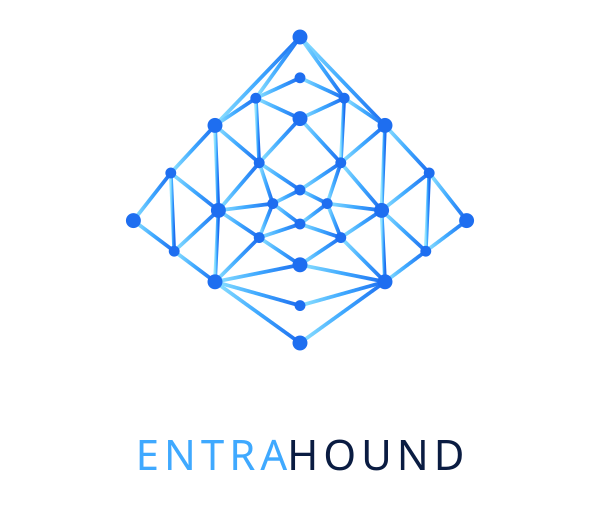

<p align="center"><picture><source media="(prefers-color-scheme: dark)" srcset="assets/logo-lockup-dark.svg"></picture></p>

# EntraHound

**Attack path and identity exposure management for Microsoft Entra ID.** BloodHound-style graph analysis, built for the cloud identity plane: users, guests, groups, roles, PIM, app registrations, service principals, managed identities, Graph permissions, OAuth consent, federated credentials, Conditional Access, cross-tenant trust and AI agent identities.

EntraHound reads a tenant through Microsoft Graph and turns it into a **directed security graph**: every identity, group, role, application, workload, device, agent, issuer and policy is a node; every membership, ownership, role assignment, credential, permission grant and trust is an edge. Then it asks the only question that matters:

> Which combinations of identities, permissions, ownership, credentials and trust relationships create a path to our critical assets?

It is **one HTML file**. It runs entirely in your browser, is **read-only**, needs no backend, and nothing leaves your machine except calls to `graph.microsoft.com`.

> Preview. Built and maintained by [Blue16 Cybersecurity](https://blue16.nl). Live copy: https://blue16.nl/entra-hound.html

## Try it in 30 seconds

Open `entra-hound.html` over http(s) — for instance `python -m http.server 8080` in the repo folder — and pick **Demo tenant**. It generates a synthetic Contoso with deliberately planted exposure (a guest who owns a group that holds Global Administrator, a developer who owns an app whose service principal can assign roles, a GitHub repo federated into an app with `Application.ReadWrite.All`, an AI agent blueprint reaching Microsoft Graph, PIM eligibility, Conditional Access exclusions…) so you can explore every view without signing in.

## Connecting to a real tenant

Three ways in:

1. **Interactive sign-in** — a single-page-application registration in the tenant you want to assess. Delegated permissions; what you see is the intersection of the app's consent and your own role. Global Reader or Security Reader is enough. **Global Administrator is never required.**
2. **External token** — paste an access token for `https://graph.microsoft.com` minted outside the browser with a certificate, client secret or managed identity. The token stays in the tab's memory.
3. **Demo tenant** — see above.

### App registration

- Platform **Single-page application**, redirect URI = the URL you serve the page from (for the hosted copy: `https://blue16.nl/entra-hound.html`; add `http://localhost:8080/entra-hound.html` or similar while testing).
- MSAL cannot run from `file://`; serve the page over http(s).

### Permissions

| Permission | Unlocks |
|---|---|
| `Directory.Read.All` (**required**) | organisation, domains, licences, users, groups + owners + members, app registrations + owners + federated credentials, service principals + owners, application permission grants, delegated consent, directory roles + members, role definitions, role assignments (incl. AU-scoped), administrative units, devices |
| `Policy.Read.All` | Conditional Access policies (coverage and exclusions), security defaults, authorization policy, cross-tenant access settings, authentication strengths |
| `RoleManagement.Read.Directory` | PIM eligible and time-bound active assignments |
| `AuditLog.Read.All` | last sign-in per user (dormancy) |
| `UserAuthenticationMethod.Read.All` | MFA registration per user |
| `AgentIdentityBlueprint.Read.All`, `AgentIdentity.Read.All`, `AgentIdentityBlueprintPrincipal.Read.All` | agent identities, blueprints, owners and sponsors |

Optional permissions are tried silently. A missing one is reported per source and the affected edges and findings do not appear — **and every conclusion says so** (see *Coverage* below).

Collection is rate-limit aware (`429` → `Retry-After`), uses `$batch` for per-object reads, is tenant-scoped, and logs every request (exportable).

## What you get

- **Dashboard** — Identity Exposure Score (0–100, graded A–F), inventory and exposure tiles, the most exposed critical assets, and the choke points that the most paths pass through.
- **Attack paths** — 19 predefined analyses: paths to Global Administrator, Privileged Role Administrator, Conditional Access Administrator, Application Administrator, Authentication Administrator, privileged applications; paths from guests, standard users, workload identities, AI agents, external identities; paths through group ownership, application ownership, credential modification, OAuth permissions, federation, hybrid identities, password/MFA reset, PIM activation. Every path is risk-scored and carries remediation.
- **Graph explorer** — Cytoscape canvas with search, type filters, expand, shortest path A→B, paths from a node, force / hierarchy / concentric layouts, full screen, zoom cluster and a mini-map for large graphs. Small graphs render as cards with chips; large graphs as glyph nodes.
- **Findings** — 30 kinds (privileged guest, nested privileged group, privileged group owner, app or service principal owned by a low-privileged identity, dangerous application and delegated permissions, tenant-wide risky consent, long-lived / expired / expiring credentials, federated credentials and wildcard federation, role-assignable group exposure, PIM eligibility, Tier-0 synced from AD, privileged without MFA, Conditional Access exclusions and gaps, legacy auth, weak tenant settings, partner trust, agent identities…), each with remediation.
- **Query engine** — plain-English questions ("Which guests can reach privileged roles?") translated to a graph grammar: `paths from <selector> to <selector> [via <edge>] [all]`, `nodes <selector>`, `who can reach <selector>`, `what can <selector> reach`, `edges <kind>`.
- **Inventory** — users, groups, apps, service principals, managed identities, agents, roles, permissions, devices, CA policies, partners, and the raw edge list; AND-filter on any word including flag names (`guest privileged`, `tier0 nomfa`).
- **Export** — JSON (everything), CSV (findings, paths, identities, applications, relationships, critical assets, remediation, collection log), and a self-contained HTML report (print for PDF).

## The graph

**Node types:** user, guest, group, directory role (tenant-wide and AU-scoped), app registration, service principal, managed identity, device, agent identity, agent blueprint, tenant, resource API, permission, external issuer (federated credential or on-premises AD), partner tenant, administrative unit, CA policy.

**Edge kinds:** `MemberOf`, `OwnerOf`, `AssignedRole`, `EligibleRole`, `ScopedRole`, `RunsAs`, `HasApplicationPermission`, `HasDelegatedPermission`, `FederatedWith`, `SyncedFromAD`, `CanBecome`, and the derived capability edges `CanAddCredential`, `CanModifyGroupMembership`, `CanResetPassword`, `CanModifyAuthenticationMethods`, `CanAssignRole`, `CanGrantConsent`, `CanModifyConditionalAccess`, `CanModifyFederation`, `CanControl`. Informational (non-traversable): `CreatedFrom`, `SponsorOf`, `ManagerOf`, `RegisteredOwnerOf`, `TrustedBy`, `ExcludedFrom`, `MemberOfAU`.

Every edge carries a mode — `DIRECT`, `INHERITED` (derived from a role or permission), `ELIGIBLE` (needs PIM activation) or `CONDITIONAL` (depends on a user signing in, or a wildcard trust) — and a weight the path engine uses. Capability edges are derived from what a role or Graph permission lets its holder do, and only towards targets that themselves lead somewhere, so an Application Administrator gets `CanAddCredential` edges to privileged apps, not to every app in the tenant.

### Critical assets

Marked automatically: Tier-0 directory roles (Global Administrator, Privileged Role Administrator, Privileged Authentication Administrator, Application and Cloud Application Administrator, Conditional Access Administrator, Hybrid Identity / Directory Synchronization, Partner Tier support, Domain Name Administrator), role-assignable groups, workloads holding Tier-0 Graph permissions, the Tier-0 permissions themselves and the tenant. Right-click a node in the graph or use ★ in a detail panel to add or remove custom ones; overrides are stored per tenant in the browser.

**Tier-0 Graph permissions:** `RoleManagement.ReadWrite.Directory`, `AppRoleAssignment.ReadWrite.All`, `Application.ReadWrite.All`, `DelegatedPermissionGrant.ReadWrite.All`, `RoleEligibilitySchedule.ReadWrite.Directory`, `RoleAssignmentSchedule.ReadWrite.Directory`, `PrivilegedAccess.ReadWrite.AzureAD`, `Domain.ReadWrite.All`, `UserAuthenticationMethod.ReadWrite.All`.

### Path semantics and risk

Shortest weighted paths (Dijkstra, reverse from each critical asset) from every identity to every critical asset, one per identity and the *first* critical asset it reaches, with an exact "via" constraint for analyses that must use a particular edge kind. A bounded all-paths mode enumerates alternatives.

Path score = target value (tenant / Tier-0 role 100, Tier-0 permission 95, Tier-0 workload 90, role-assignable group 80, Tier-1 role 65 …) × path-length factor × mode factor (eligible 0.85, conditional 0.65) + source modifiers (guest, external issuer, on-premises, no MFA, excluded from or not covered by Conditional Access, dormant, secret / federated credential; disabled accounts are discounted). Severity: Critical ≥ 85, High ≥ 65, Medium ≥ 45, Low ≥ 25.

The **Identity Exposure Score** weighs attack paths 35 %, Tier-0 account hygiene 20 %, dangerous permissions 15 %, findings 20 % and guest reach 10 %. It measures reachable privilege, not configuration noise.

## Coverage: unknown is not the same as none

A missing edge because collection was denied is a different thing from an edge that does not exist. Every source that did not come back is mapped to the edges, analyses, findings and node sections it blinds, and that caveat travels with every conclusion: the score says "N of M sources · lower bound" and lists what was not collected; an analysis whose inputs were denied shows `106?` and "partial · … not collected" instead of a clean zero; each gap is also a finding with the permission that fixes it; the detail panel says which sections may be empty because the tool could not look; the report leads with the coverage table.

## Architecture

```
Microsoft Graph → Collector → Normalisation → Relationship engine → In-memory graph
              → Attack path engine → Risk engine → Findings → Dashboard / Explorer / Query / Export
```

All of it lives in `entra-hound.html` as separate modules (`EH.auth`, `EH.graph`, `EH.collector`, `EH.model`, `EH.engine`, `EH.risk`, `EH.findings`, `EH.coverage`, `EH.analyses`, `EH.ui`). The raw collection is stored as received and never mutated; the graph, paths, scores and findings are derived from it. Splitting the layers into a collector service, a graph database and an API is a port, not a rewrite.

Dependencies, both SRI-pinned: [`@azure/msal-browser` 3.28.1](https://github.com/AzureAD/microsoft-authentication-library-for-js) and [Cytoscape.js 3.30.4](https://js.cytoscape.org/). Bumping either version means recomputing the hash on both script tags.

## Limits

- Browser-only: group members are read for all groups up to a cap; beyond it role-holding, owning, CA-referenced and security groups come first.
- Owners come from `$expand` (first 20 per object).
- Agent identity endpoints are beta and only answer in tenants with Entra Agent ID.
- The tool infers attack possibilities from effective permissions; it never exploits anything.

## Contributing

Issues and pull requests are welcome. If you report a path the tool misses or a path it should not report, include the edge chain and the mode (direct / eligible / conditional) — that is what the relationship engine reasons about. Security issues: see [SECURITY.md](SECURITY.md).

## Licence

[MIT](LICENSE) © 2026 Blue16 Cybersecurity.
